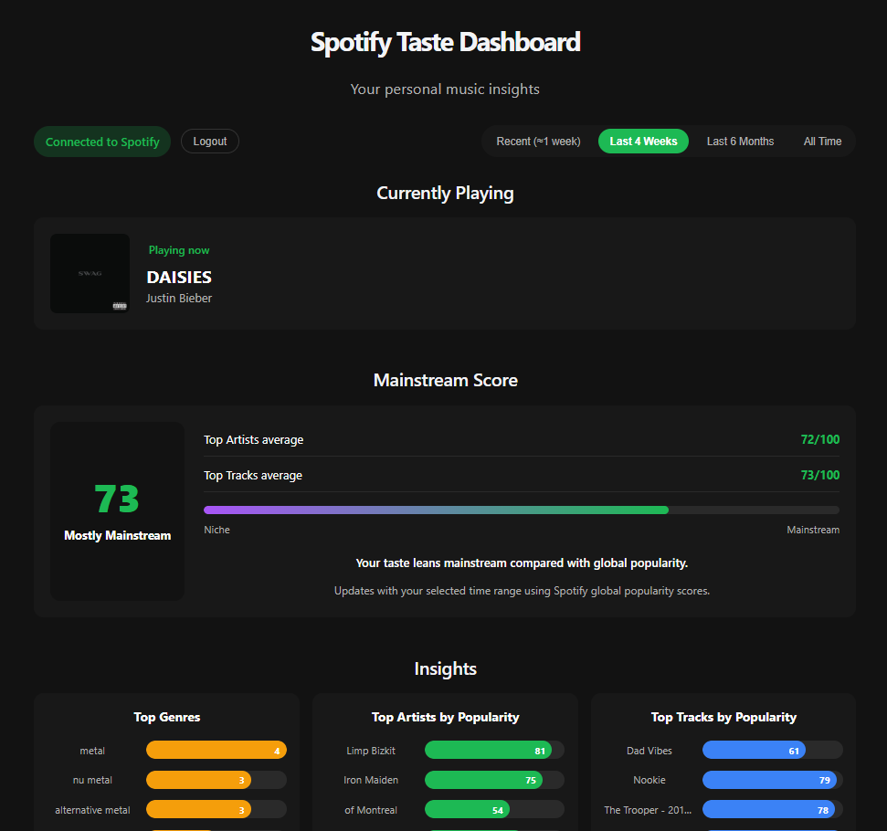
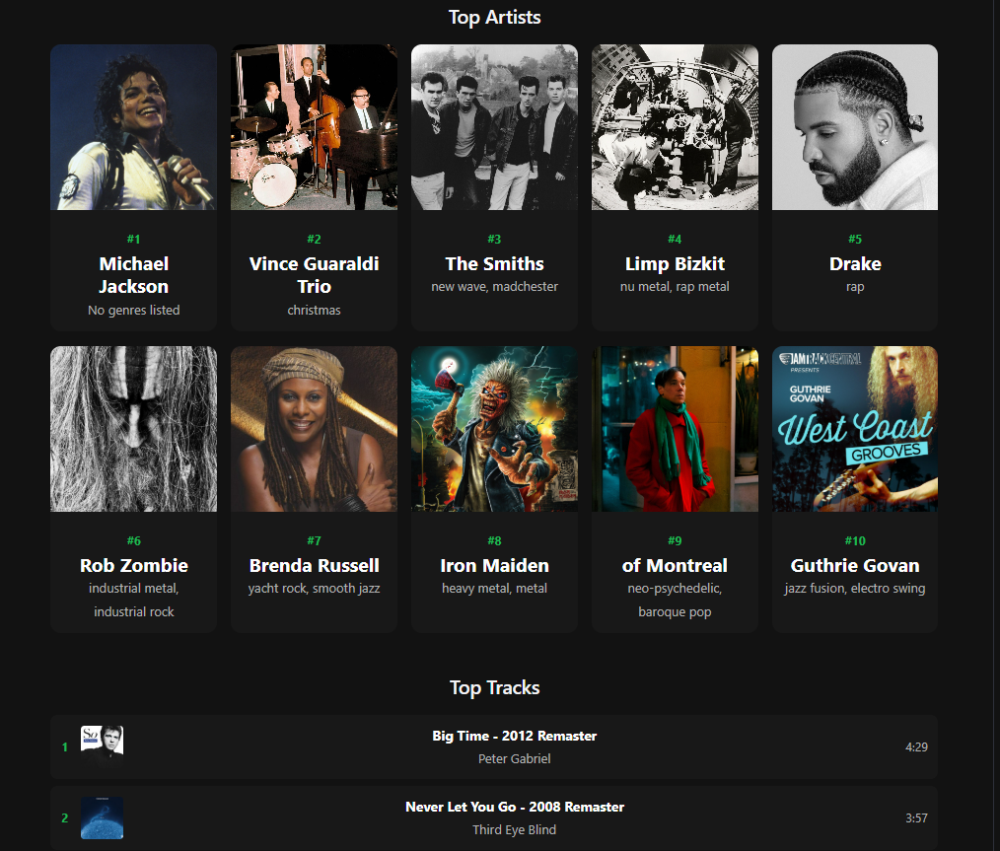

# Spotify Taste Dashboard

A full-stack personal music insights app that connects to your Spotify account and visualizes your listening taste.

Built with Vue 3 + TypeScript on the frontend and Python FastAPI on the backend.

## Features

- Login with Spotify (OAuth 2.0)
- Currently Playing
- Top Artists and Top Tracks
- Recently Played
- Time range filters:
  - Recent (approx 1 week)
  - Last 4 Weeks
  - Last 6 Months
  - All Time
- Genre insights
- Popularity charts
- Recently played frequency chart
- Mainstream Score (niche vs mainstream)
- Token refresh support
- Dark Spotify-inspired UI

## Demo




Watch a short walkthrough: [Loom Demo](https://www.loom.com/share/ce47349bfa3346b382a37204712429d8)

## Tech Stack

Frontend:
- Vue 3
- TypeScript
- Vite

Backend:
- Python
- FastAPI
- httpx
- python-dotenv

APIs:
- Spotify Web API

## Architecture

Vue Frontend -> FastAPI Backend -> Spotify Web API

- Frontend stores tokens in localStorage
- Backend handles OAuth and token refresh

## Setup

### 1. Clone the repo

```bash
git clone <your-repo-url>
cd spotify-taste-dashboard
```

### 2. Backend setup

```bash
cd backend
python -m venv venv
```

Activate the virtual environment:

Git Bash:
```bash
source venv/Scripts/activate
```

PowerShell:
```bash
venv\Scripts\Activate.ps1
```

Install dependencies:
```bash
pip install -r requirements.txt
```

Create `backend/.env`:

```env
SPOTIFY_CLIENT_ID=your_client_id
SPOTIFY_CLIENT_SECRET=your_client_secret
SPOTIFY_REDIRECT_URI=http://127.0.0.1:8000/api/callback
```

Run the backend:
```bash
uvicorn main:app --reload --port 8000
```

### 3. Frontend setup

```bash
cd frontend
npm install
npm run dev -- --host 127.0.0.1 --port 5173
```

Open:
```text
http://127.0.0.1:5173
```

## Spotify Developer Setup

1. Go to the Spotify Developer Dashboard
2. Create an app
3. Add this redirect URI exactly:
   `http://127.0.0.1:8000/api/callback`
4. Copy the Client ID and Client Secret into `backend/.env`
5. Add your Spotify account under User Management (Development Mode)

## Notes

- Spotify does not provide personal play counts through the official API
- Popularity scores are global (0-100), not personal listen counts
- "Recent (approx 1 week)" is approximated from Recently Played data
- Access tokens expire in about 1 hour; refresh tokens are supported

## Author

Matt G. Gonzales  
Salesforce Application Architect | Full-Stack Developer